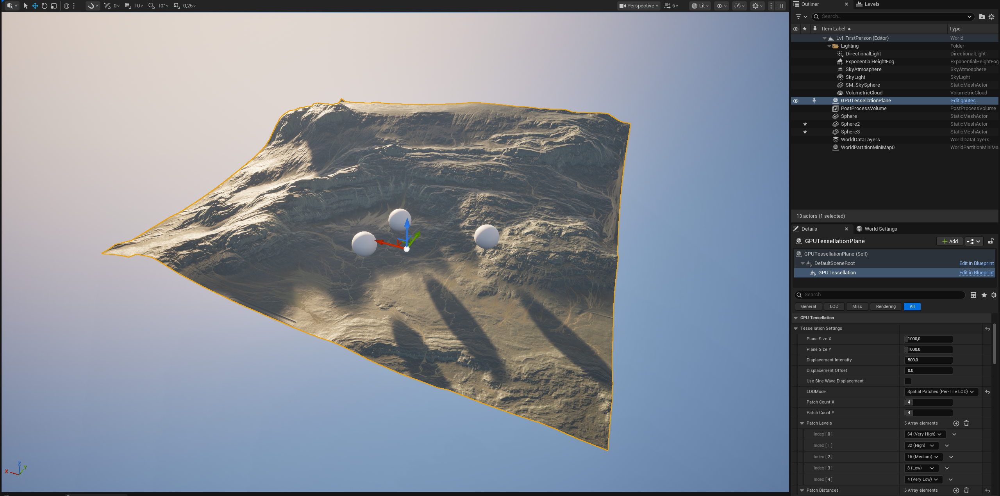
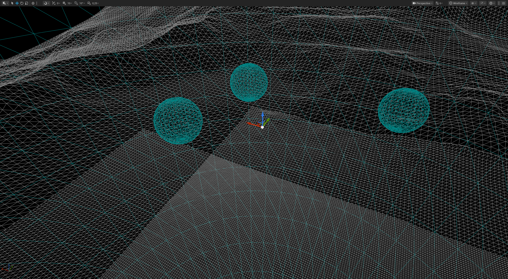
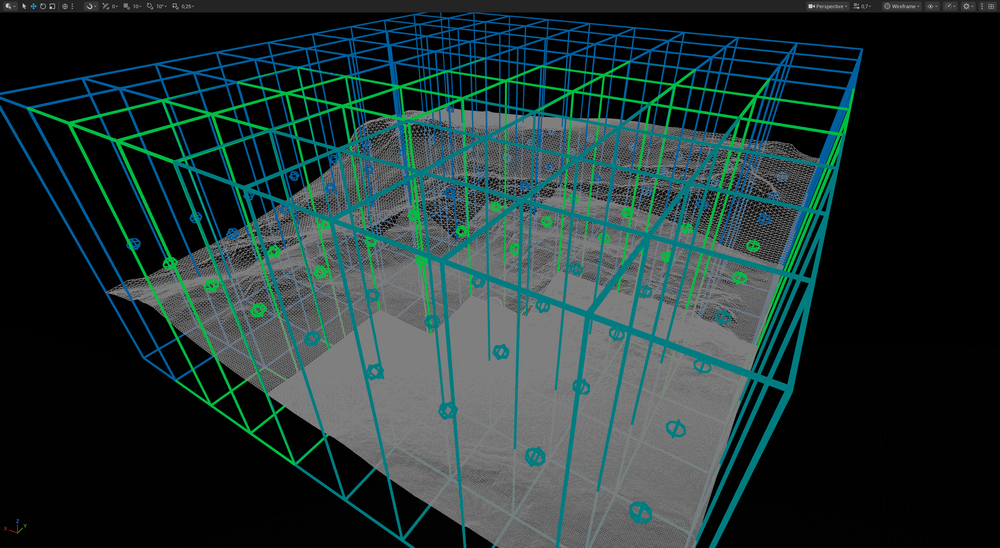

# GPU Runtime Tessellation (Compute)

[](https://www.unrealengine.com/)
[]()
[](LICENSE)
[]()

> **Compute shader-based runtime tessellation without Hull/Domain shaders. Currently optimized for planar surfaces with arbitrary mesh support planned.**

---

## Features

- **GPU Tessellation** - compute shader-based tessellation (for now CPU only handles LOD decisions)
- **Dynamic LOD System** - 5 LOD modes including spatial patch-based LOD
- **Advanced Displacement** - Texture-based, procedural, and RenderTarget support
- **Multiple Normal Methods** - Finite difference, geometry-based, hybrid, and normal map
- **Material Support** - Unreal Material system integration

---

## Quick Start

### Installation

#### Option A: Engine Plugin (Recommended)
The plugin is located in the engine's plugins folder and available to all projects:
```
UnrealEngine/Engine/Plugins/Experimental/GPURuntimeTessellation/
```

To use it in your project:
1. Enable the plugin in your project via Editor: **Edit → Plugins → Search "GPU Runtime Tessellation" → Enable**
2. Restart the editor
3. The plugin is now available in your project

#### Option B: Project Plugin (Portable)
For project-specific installation:
1. Copy the plugin folder to your project's `Plugins` directory:
   ```
   YourProject/Plugins/GPURuntimeTessellation/
   ```

2. Enable the plugin in your project's `.uproject` file:
   ```json
   "Plugins": [
       {
           "Name": "GPURuntimeTessellation",
           "Enabled": true
       }
   ]
   ```

3. Regenerate project files and compile

**Note**: Engine plugins (Option A) are not packaged with your project. For distribution, use Option B or ensure target systems have the plugin in their engine installation.


## Known build issues

- Build errors when compiling the plugin with the Epic Games Launcher UE 5.6
  that did not appear when compiling with a locally source-built UE 5.6.
- Compiler errors referencing `UE::Core::Private::FormatStringSan`, template
  format validation, or `ArgumentNullException` from UnrealBuildTool when
  loading module rules.
- Runtime: shadows not appearing when using Virtual Shadow Maps (they work
  when switching to standard shadow maps).

## Root Causes

1. Stricter format-string validation and constexpr checks were added in the
   Epic-built engine toolchain. `UE_LOG` calls containing non-constexpr
   expressions triggered compile-time template errors when the log format
   sanitizer attempted to validate arguments.

2. Forward declarations for types like `FGPUTessellationSettings` were
   insufficient in some headers; the launcher build required full includes in
   order to resolve types at the point of module rule evaluation.

3. Virtual Shadow Maps (VSM) differ from standard shadowmap rendering paths;
   the plugin's dynamic GPU mesh generation and vertex factory expectations
   are currently validated against the standard shadowmap rendering path.


### Basic Usage (C++)

```cpp
#include "GPUTessellationComponent.h"

// Create component
UGPUTessellationComponent* TessComp = CreateDefaultSubobject<UGPUTessellationComponent>(TEXT("Tessellation"));

// Configure settings
TessComp->TessellationSettings.TessellationFactor = 16;
TessComp->TessellationSettings.PlaneSizeX = 1000.0f;
TessComp->TessellationSettings.PlaneSizeY = 1000.0f;
TessComp->TessellationSettings.DisplacementIntensity = 100.0f;

// Set displacement texture
TessComp->SetDisplacementTexture(MyHeightMap);

// Set material
TessComp->SetMaterial(0, MyMaterial);
```

### Basic Usage (Blueprint)

1. Add `GPUTessellationComponent` to your actor
2. Configure properties in the Details panel:
   - Set `Tessellation Factor`
   - Assign `Displacement Texture`
   - Choose `Normal Calculation Method`
   - Assign `Material`
3. Enable `Auto Update` for dynamic LOD

---

## Why?

**Unreal Engine 5 removed support for Hull/Domain shader tessellation** in favor of Nanite virtualized geometry. However, Nanite doesn't fully and perfectly support runtime displacement or procedural deformation. This plugin **restores tessellation capability** using a modern compute shader approach that works universally.

Traditional tessellation uses Hull and Domain shaders, which require specific hardware support and aren't available on all platforms. This plugin uses **compute shaders** instead:

### Traditional Tessellation (Removed in UE5)
```
❌ Requires hardware tessellation units
❌ Platform-limited (DirectX 11+ specific)
❌ Fixed pipeline, hard to customize
❌ Difficult to debug
```

### Compute Tessellation
```
✅ Works on ANY platform with compute shader support
✅ Complete control over tessellation logic
✅ Easy to debug and profile
✅ Future-proof architecture
✅ Minimal CPU overhead (only LOD decisions, ~0.05-0.2ms)
```

---

## Architecture

```
┌─────────────────────────────────────┐
│   UGPUTessellationComponent         │  ← Blueprint/C++ API
└──────────────┬──────────────────────┘
               │
               ▼
┌─────────────────────────────────────┐
│   FGPUTessellationSceneProxy        │  ← Rendering Thread
└──────────────┬──────────────────────┘
               │
               ▼
┌─────────────────────────────────────┐
│    GPU COMPUTE PIPELINE             │  ← 5 Compute Shaders
│                                     │
│   1. Vertex Generation              │
│   2. Displacement Mapping           │
│   3. Normal Calculation             │
│   4. Tangent Calculation            │
│   5. Index Generation               │
└──────────────┬──────────────────────┘
               │
               ▼
┌─────────────────────────────────────┐
│   GPU Buffers (Stay on GPU!)        │  ← No CPU Readback
└──────────────┬──────────────────────┘
               │
               ▼
┌─────────────────────────────────────┐
│   Material Rendering                │  ← Standard Unreal
└─────────────────────────────────────┘
```

---

## LOD System

### Distance-Based Smooth LOD
Smooth tessellation transitions based on camera distance.

```cpp
Settings.LODMode = EGPUTessellationLODMode::DistanceBased;
Settings.MaxTessellationFactor = 64;  // Close range
Settings.MinTessellationFactor = 8;   // Far range
Settings.MaxTessellationDistance = 10000.0f;
```

### Distance-Based Discrete LOD
Discrete tessellation levels for better performance.

```cpp
Settings.LODMode = EGPUTessellationLODMode::DistanceBasedDiscrete;
Settings.DiscreteLODLevels = {
    EGPUTessellationPatchLevel::Patch_64,  // Closest
    EGPUTessellationPatchLevel::Patch_32,
    EGPUTessellationPatchLevel::Patch_16,
    EGPUTessellationPatchLevel::Patch_8    // Farthest
};
Settings.DiscreteLODDistances = { 2000.0f, 5000.0f, 10000.0f, 20000.0f };
```

### Spatial Patch LOD
Divide terrain into patches with per-patch LOD - **Best for large terrains!**

```cpp
Settings.LODMode = EGPUTessellationLODMode::DistanceBasedPatches;
Settings.PatchCountX = 4;  // 4×4 = 16 patches
Settings.PatchCountY = 4;
Settings.bEnablePatchCulling = true;  // Frustum culling per patch
```

**Performance gain**: 60-80% for large open-world terrains!

---

## Examples

### Terrain with Displacement

```cpp
UCLASS()
class AMyTerrain : public AActor
{
    GENERATED_BODY()

public:
    AMyTerrain()
    {
        TessComp = CreateDefaultSubobject<UGPUTessellationComponent>(TEXT("Terrain"));
        RootComponent = TessComp;

        // Terrain settings
        TessComp->TessellationSettings.TessellationFactor = 32;
        TessComp->TessellationSettings.PlaneSizeX = 10000.0f;  // 100m × 100m
        TessComp->TessellationSettings.PlaneSizeY = 10000.0f;
        TessComp->TessellationSettings.DisplacementIntensity = 500.0f;
        TessComp->TessellationSettings.bUseSineWaveDisplacement = false;
        
        // Enable LOD
        TessComp->TessellationSettings.LODMode = EGPUTessellationLODMode::DistanceBased;
        TessComp->TessellationSettings.MaxTessellationFactor = 64;
        TessComp->TessellationSettings.MinTessellationFactor = 8;
        
        // Normal calculation
        TessComp->TessellationSettings.NormalCalculationMethod = 
            EGPUTessellationNormalMethod::FiniteDifference;
    }

    UPROPERTY(VisibleAnywhere)
    UGPUTessellationComponent* TessComp;
};
```

### Water Surface

```cpp
UCLASS()
class AWaterSurface : public AActor
{
    GENERATED_BODY()

public:
    AWaterSurface()
    {
        TessComp = CreateDefaultSubobject<UGPUTessellationComponent>(TEXT("Water"));
        
        // Water settings
        TessComp->TessellationSettings.TessellationFactor = 32;
        TessComp->TessellationSettings.PlaneSizeX = 5000.0f;
        TessComp->TessellationSettings.PlaneSizeY = 5000.0f;
        TessComp->TessellationSettings.DisplacementIntensity = 50.0f;
        TessComp->TessellationSettings.bUseSineWaveDisplacement = true;
        
        // Smooth normals
        TessComp->TessellationSettings.NormalCalculationMethod = 
            EGPUTessellationNormalMethod::Hybrid;
        TessComp->TessellationSettings.NormalSmoothingFactor = 0.7f;
        
        TessComp->bAutoUpdate = true;
    }

    UPROPERTY(VisibleAnywhere)
    UGPUTessellationComponent* TessComp;
};
```

### Runtime Painting (Snow/Footprints)

```cpp
void ASnowTerrain::SetupRuntimePainting()
{
    // Create RenderTarget for painting
    UTextureRenderTarget2D* PaintRT = NewObject<UTextureRenderTarget2D>();
    PaintRT->RenderTargetFormat = RTF_RGBA8;
    PaintRT->InitAutoFormat(512, 512);
    PaintRT->UpdateResourceImmediate(true);
    
    // Set as subtract texture (white = no displacement, black = full displacement)
    TessComp->SetSubtractTexture(PaintRT);
}

void ASnowTerrain::PaintFootprint(FVector WorldLocation)
{
    // Convert world location to UV
    FVector LocalPos = GetActorTransform().InverseTransformPosition(WorldLocation);
    float U = (LocalPos.X / TessComp->TessellationSettings.PlaneSizeX) + 0.5f;
    float V = (LocalPos.Y / TessComp->TessellationSettings.PlaneSizeY) + 0.5f;
    
    // Draw white circle to RenderTarget (creates footprint effect!)
    DrawCircleToRenderTarget(PaintRT, U, V, 0.05f, FLinearColor::White);
}
```

---

## Performance


1. **Use Patch Mode** for large terrains (60-80% performance gain)
2. **Enable LOD System** with appropriate distance thresholds
3. **Use FiniteDifference** normals for speed (default)
4. **Frustum Culling** is still experimental (needs to be implemented correctly in future)
5. **Pre-bake Normal Maps** is still experimental (needs to be implemented correctly so use in-material normalmap instead - did this feature mostly for test purposes with patch based system)

---


## API Reference

### Component Functions

```cpp
// Update mesh manually
void UpdateTessellatedMesh();

// Set textures
void SetDisplacementTexture(UTexture2D* InTexture);
void SetSubtractTexture(UTexture2D* InTexture);  // Supports RenderTargets!
void SetNormalMapTexture(UTexture2D* InTexture);

// Update settings
void UpdateSettings(const FGPUTessellationSettings& NewSettings);

// Query information
FIntPoint GetTessellationResolution() const;
int32 GetVertexCount() const;
int32 GetTriangleCount() const;
```

### Blueprint Nodes

All C++ functions are exposed to Blueprint with the `BlueprintCallable` or `BlueprintPure` specifiers.

---

### Minimum Requirements
- **Feature Level**: SM5 (Shader Model 5.0)
- **Compute Shader Support**: Required
- **GPU**: Any modern GPU with compute shader support

---

## Troubleshooting

### Mesh Not Appearing
- Verify displacement intensity isn't extreme
- Check component bounds (might be culled)

### Normals Look Wrong
- Uncheck in material Tangent Space Normal
- Try different normal calculation methods
- Check displacement texture range (should be 0-1)
- Verify normal map format (BC5 recommended)
- Toggle `bInvertNormals` if upside-down

### Poor Performance
- Enable LOD system (DistanceBased or Patches)
- Reduce tessellation factor
- Use patch mode for large terrains

### Debug Mode
Enable debug logging for troubleshooting:
```cpp
TessComp->bEnableDebugLogging = true;
TessComp->bShowPatchDebugVisualization = true;  // Editor only
```

---

## Technical Details

### Compute Shader Pipeline

1. **Vertex Generation** (`GPUVertexGeneration.usf`)
   - Generates grid vertices on GPU
   - Calculates UVs and base normals
   - Thread group: 8×8×1

2. **Displacement** (`GPUDisplacement.usf`)
   - Samples displacement texture on GPU
   - Applies height displacement
   - Supports RenderTarget masking
   - Thread group: 64×1×1

3. **Normal Calculation** (`GPUNormalCalculation.usf`)
   - Calculates normals using chosen method
   - Supports finite difference, geometry-based, hybrid, and normal map
   - Thread group: 64×1×1
NOTE: The vertex factory uses a simplified tangent basis (axis-aligned) for performance. Normal maps expect tangents that follow UV gradients on the displaced surface. This mismatch causes distortion. Use geometric normals instead (uncheck "Tangent Space Normal" in material).

4. **Tangent Calculation** (`GPUTangentCalculation.usf`)
   - Generates tangent space for normal mapping
   - Thread group: 64×1×1

5. **Index Generation** (`GPUIndexGeneration.usf`)
   - Generates triangle indices
   - Thread group: 8×8×1

### GPU Buffers (Zero CPU Readback)
```cpp
struct FGPUTessellationBuffers
{
    FBufferRHIRef PositionBuffer;   // Stays on GPU
    FBufferRHIRef NormalBuffer;     // Stays on GPU
    FBufferRHIRef UVBuffer;         // Stays on GPU
    FBufferRHIRef TangentBuffer;    // Stays on GPU
    FBufferRHIRef IndexBufferRHI;   // Stays on GPU
};
```

All buffers are created by compute shaders and **never leave GPU memory** - ensuring maximum performance!

---

## Limitations

- **Planar Meshes Only**: Currently designed for flat planes (terrain, water, floors)
- **Not for Arbitrary 3D Meshes**: Not suitable for characters or complex 3D models
- **Dynamic Updates**: Settings changes trigger GPU recompute (fast, but not every frame)

---

## Roadmap

- [ ] Collision system
- [ ] Virtual Shadow Maps integration
- [x] Seamless improvement for patch system
- [ ] Complete Density Texture LOD implementation
- [ ] Support for arbitrary base meshes
- [ ] GPU-driven autonomous LOD (move LOD calculations to GPU)
- [ ] Automatic water/ocean simulation
- [ ] Optional Subdivision
- [ ] Optional CDLOD mode with morphing

---

## Contributing

This is an experimental plugin. Contributions, issues, and feature requests are welcome!

---

## License

This project is licensed under the MIT License.

Some parts of the code were generated with assistance from AI tools (e.g., Github Copilot - Anthropic Claude 4.5 / OpenAI GPT-5).
Note: This plugin is still highly experimental and definitely not production ready.

---

## Use Cases

### Perfect For
- Terrain systems
- Water surfaces
- Procedural ground planes
- Displacement-mapped floors
- Large open-world environments
- Cross-platform projects
- Real-time dynamic displacement (snow, footprints)

### Not Yet Ideal For
- Character meshes
- Complex 3D models
- Per-frame animated displacement (heavy)
- Mobile low-end devices

---

## Key Advantages

| Feature | Traditional Tessellation | Compute Tessellation |
|---------|-------------------------|---------------------------|
| **Platform Support** | DirectX 11+ specific | Universal (SM5+) |
| **Hardware Required** | Tessellation units | Compute shaders only |
| **Debugging** | Opaque, hard to debug | Full shader debugging |
| **Flexibility** | Fixed pipeline | Complete control |
| **LOD Control** | Limited | Advanced custom systems |
| **Future-Proof** | Legacy feature | Core modern API feature |

---

## Acknowledgments

Built for Unreal Engine 5.6.1 as an experimental plugin demonstrating  compute shader-based tessellation as a replacement for traditional Hull/Domain shader pipelines.

---
### Screenshots








---
**Made for the Unreal Engine community**
